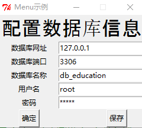
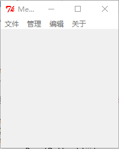

学生信息管理系统
========================

   编写这个小程序的初衷是有个朋友自己教几个学生课程，想管理一些学生的信息（例如个人信息，报名，收费，课时等），但网上的软件要么复杂，要么收费，而且没法特质化需求。我便说要不我做一个简陋的小程序（*真的十分简陋，23333*），实现这些简单的功能倒是没什么问题，之前一直想做做 python 的 GUI 相关的小程序，当做个计算器什么的意思不大，正好有个机会就当练练手。

用来做什么？
-------

  “学生管理系统” 是运行在windows/Linux环境 下用来简单的维护 `学生信息`，`课程信息` 的软件系统, 主要具备如下几个功能：
    
* 学生个人信息的添加，配置，删除；
* 课程信息的添加，配置，删除；
* 学生报名相关课程；
* 学生课时管理，统计学生的课时信息和请假信息；

如何使用？
-------
* Step1：搭建数据库环境
     
    在服务器上搭建对应的mysql服务器，并在数据库上导入 `db_education.sql`，初始化数据库和数据表。
	
* Step2：运行客户端

    “学生信息管理系统” 可以在windows下直接用运行 `.\bin\*.exe` 文件。

* Step3：配置数据库信息

    打开软件后，在菜单栏 “编辑 -- 数据库” 填写Step1中的配置信息，点击保存。 或者配置 `db.conf` 文件。

	

* Step4：登录并管理

    在 “文件 -- 登录” 使用对应的账号和密码进行登录，在导入 `db_education.sql` 之后，默认用户 `root`，密码 `admin`. 这部分可以在数据库中的 `account` 表中进行修改。
    完成登录后在 “管理” 下选择要配置的信息即可。

pyedusys
============
  如果对这个代码感兴趣，也可以安装对应的开发环境，并在这个环境下进行代码开发和修改。如下是自己搭建环境所用到的配置，供参考。

Envirentment
------------

  如下是开发过程需要用到的相应的环境和库。 

-  Python2.7
-  MySQLdb
-  Tkinter(Python自带）
-  tkMessageBox（Python自带）
-  Json
-  PyInstaller

Install
-----------------

### Step1. 安装数据库环境

* 安装 `MySQLdb`

  在客户端环境（开发环境）下安装 MySQLdb 的 Python 库这里要注意用如下的命令安装，普通的 egg 安装在 python shell 或者脚本都可以正常运行。但在用 `pyinstaller` 或者 `py2exe` 打包成 exe 文件时，会出现 “找不到 `MySQLdb`” 的问题。

    easy_install --always-unzip MySQL-python

* 安装 `mysql` 数据库

  在服务器上安装mysql数据库。 这部分网上教程很多，请根据自己的操作系统等具体情况进行安装，不做赘述。以下是Centos下的命令, Centos下安装其他问题可[参考链接](http://www.cnblogs.com/starof/p/4680083.html)：

    yum install mysql
    yum install mysql-server
    yum install mysql-devel
    
* 设置数据库远程连接

  数据库安装配置完成之后，需要设置数据库的远程连接，这样客户端才能访问服务器的数据库（*对于客户端与服务器不在一台设备上的情况需要进行配置，如果在同一台设备上，也可跳过这个步骤*）。更多信息可 [参考链接](https://blog.csdn.net/ithomer/article/details/6976148)

	mysql -u root -p;
	grant all privileges on *.* to root@'%' identified by 'admin';
	flush privileges;
	/etc/init.d/mysql restart

* 确认数据库远程连接

  设置远程连接后，可以在客户端通过如下命令确认是否能正常连接远程服务器：

    mysql -h 主机地址 -u用户名 －p用户密码 -D数据库名称

### Step2 安装Tkinter
  在Ubuntu系统下, 需要安装Tkinter(如果是Windows系统, 默认是安装了的, 可跳过这个步骤).代码如下:
  
    sudo apt-get install python-tk
    sudo apt-get install python-imaging-tk
    sudo apt-get install python-pip  # 安装pip
    sudo pip install requests

### Step2 运行main_plain.py

  由于大部分的依赖库基本是自带的，所以Python环境安装之后，基本就可以开始编程了。此时运行 `main_plain.py` ，如果能正常运行（出现如下图片的窗体），则说明环境搭建OK。

  

  如果出现报错，则需要根据对应的错误信息去排除，无法一一说明。需要注意的是，python2.x 和python3.x 的Tkinter差别还是很多的，因此这个代码仅能在python2.x下运行。

[END]
